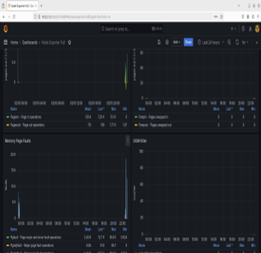
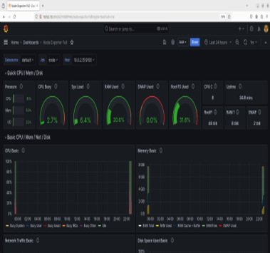

# Virtual Memory Monitoring Dashboard

## Overview
The **Virtual Memory Monitoring Dashboard** is a real-time system performance tracking solution that leverages **Prometheus** and **Grafana** to provide deep insights into virtual memory usage. It enables users to visualize and analyze key memory metrics, helping optimize system performance and detect potential issues proactively.

## Features
* **Real-time Memory Utilization Monitoring** 📊
* **Prometheus Exporters for Data Collection** 📡
* **Customizable Grafana Dashboards** 🎨
* **Alerts for Critical Memory Conditions** ⚠️
* **Tracking of Key Metrics**:
   * Heap Allocation & Usage
   * Page Faults & Swap Activity
   * Cache Hit/Miss Ratios
   * Buffer & Shared Memory Statistics

## Screenshots

### Memory Utilization Dashboard, Swap Activity Monitoring and Alert Configuration



*Real-time visualization of system memory usage with customizable time ranges*

## Technologies Used
* **Prometheus** – Collects and stores system memory metrics.
* **Grafana** – Provides an interactive dashboard for real-time visualization.
* **Node Exporter** – Exports system-level memory data for Prometheus.
* **Alertmanager** – Configured for setting up memory alerts.

## Installation & Setup

### 1. Install Prometheus & Node Exporter
```bash
sudo apt update && sudo apt install prometheus node-exporter -y
```

### 2. Configure Prometheus to Scrape Node Exporter
Edit the Prometheus configuration file (`prometheus.yml`) and add:
```yaml
scrape_configs:
  - job_name: 'node'
    static_configs:
      - targets: ['localhost:9100']
```

Restart Prometheus:
```bash
sudo systemctl restart prometheus
```

### 3. Install & Configure Grafana
```bash
sudo apt install grafana -y
sudo systemctl start grafana
```

Access Grafana at **http://localhost:3000** and add Prometheus as a data source.

### 4. Import Dashboard JSON
* Go to **Grafana → Dashboards → Import**
* Upload the **preconfigured JSON file** (included in the repository)
* Enjoy real-time virtual memory monitoring! 🚀

## Dashboard Configuration
The dashboard comes preconfigured with panels for all essential virtual memory metrics. You can further customize it according to your specific monitoring needs.



*Easy panel customization with drag-and-drop interface*

## Alerts
Configure alerts by:
1. Navigating to the Alert tab in Grafana
2. Setting thresholds for critical memory conditions
3. Choosing notification channels (email, Slack, PagerDuty, etc.)

## Requirements
* Linux-based operating system
* Minimum 1GB RAM
* 2GB free disk space for metrics storage
* Root or sudo access for installation

## Troubleshooting
* If metrics aren't appearing, check that Node Exporter is running with `systemctl status node-exporter`
* Verify Prometheus is scraping correctly by visiting `http://localhost:9090/targets`
* For Grafana connection issues, ensure the Prometheus data source is properly configured
